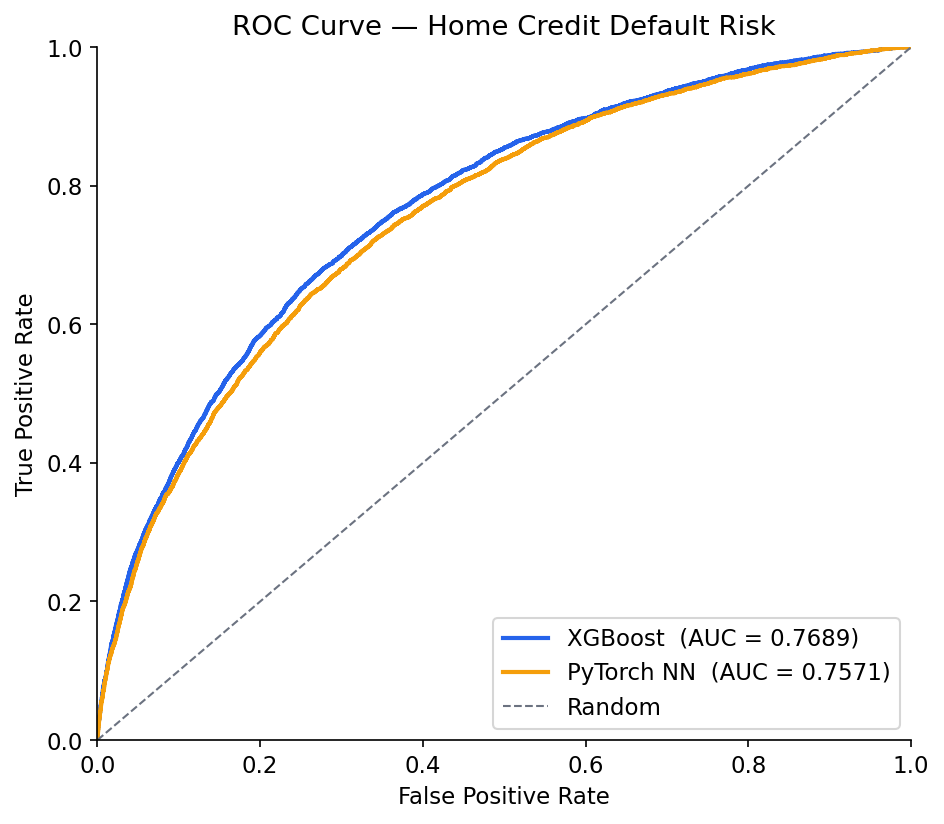
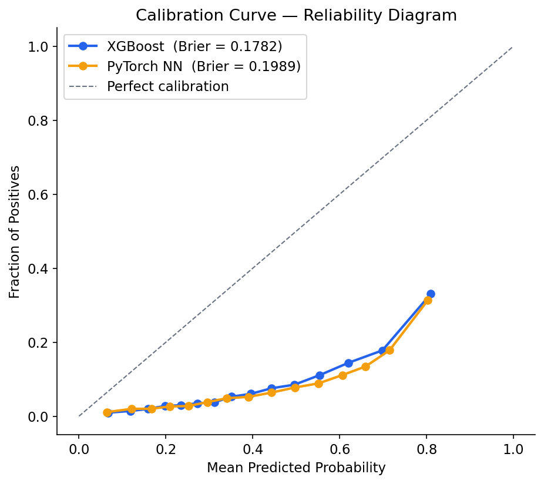
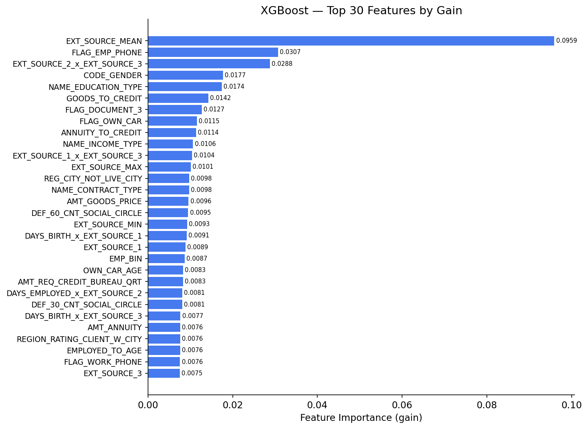
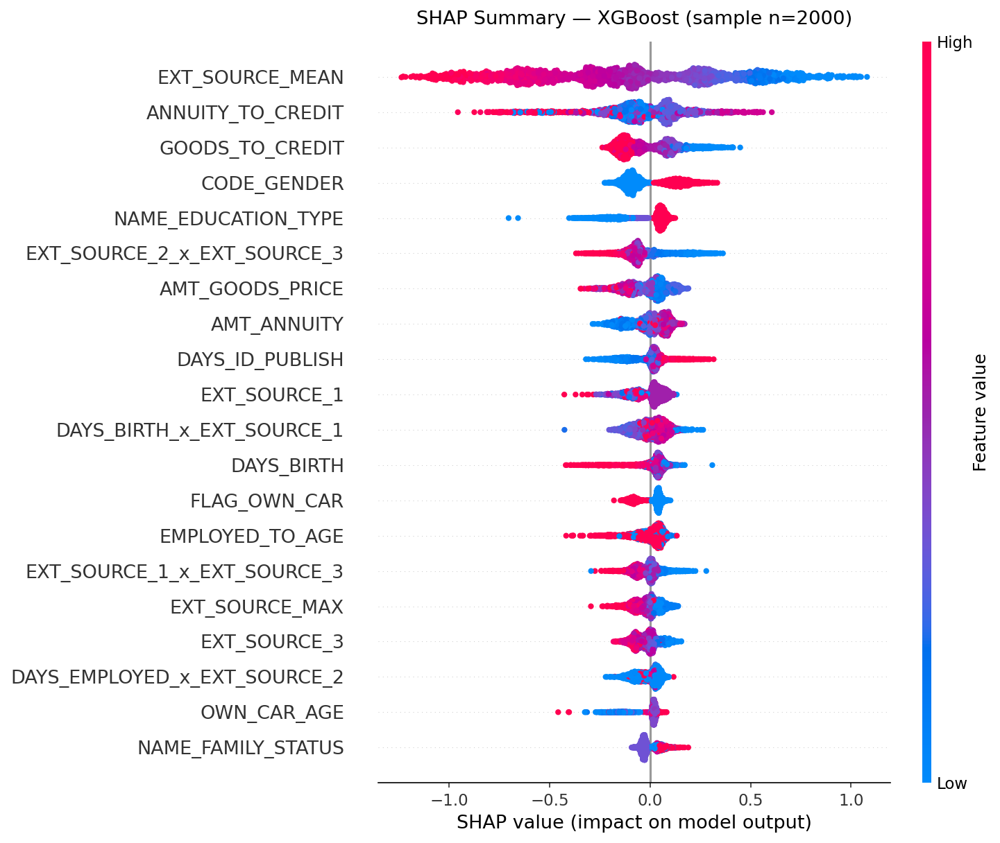

<div align="center">

# ML1 — Deep Learning Credit Risk Scorer

[](https://python.org)
[](https://pytorch.org)
[](https://xgboost.readthedocs.io)
[](https://fastapi.tiangolo.com)
[](https://streamlit.io)
[](tests/)
[](LICENSE)

**Production-grade credit default risk scorer** combining a PyTorch attention neural network with an XGBoost baseline, served via FastAPI and visualised in an interactive Streamlit dashboard.

Trained on 307,511 real loan applications from the [Home Credit Default Risk](https://www.kaggle.com/c/home-credit-default-risk) Kaggle competition.

[**Live Demo**](https://ml1-credit-risk-scorer.streamlit.app) · [**API Docs**](http://localhost:8000/docs) · [**Portfolio**](https://fahadamjad009.github.io)

</div>

---

## Results

| Model | Val AUC | Gini | KS Statistic | Brier Score | Training Time |
|:---|:---:|:---:|:---:|:---:|:---:|
| **XGBoost** (baseline) | **0.7689** | **0.5379** | **0.4028** | **0.1782** | 13s |
| PyTorch Attention NN | 0.7571 | 0.5142 | 0.3814 | 0.1989 | ~2min |

> Single-table only (`application_train.csv`). Production models with auxiliary bureau tables typically reach 0.80+ AUC on this dataset.

---


## Screenshots

### Live Prediction Dashboard & Model Evaluation







**FastAPI Swagger UI**

REST API with `/predict` and `/predict/batch` endpoints, full OpenAPI schema.

</td>
</tr>
</table>

---

## Architecture

```
Input (143 engineered features)
         │
         ▼
  ┌─────────────────────────┐
  │   Feature Attention Gate │  ← learns per-feature importance
  │  Linear(143→286)→ReLU   │
  │  Linear(286→143)→Sigmoid│
  │  x = x ⊙ gate(x)       │
  └────────────┬────────────┘
               │
         ┌─────▼─────┐
         │  BN + MLP  │
         │  143→256   │  GELU + Dropout(0.3)
         │  256→128   │  GELU + Dropout(0.3)
         │  128→64    │  GELU + Dropout(0.2)
         │   64→1     │
         └─────┬──────┘
               │
         BCEWithLogitsLoss
         pos_weight = 11.4   ← handles 91/9 class imbalance
```

**Training config:** AdamW · lr=3e-4 · cosine annealing · early stopping (patience=8) · batch=2048

---

## Feature Engineering

120 raw features → **143 engineered features** (+23)

| Category | Features | Examples |
|:---|:---:|:---|
| Domain ratios | 7 | `ANNUITY_TO_INCOME`, `CREDIT_TO_INCOME`, `GOODS_TO_CREDIT` |
| EXT_SOURCE aggregates | 4 | `EXT_SOURCE_MEAN`, `MIN`, `MAX`, `STD` |
| Polynomial interactions | 10 | `EXT_SOURCE_1_x_EXT_SOURCE_2`, `DAYS_BIRTH_x_EXT_SOURCE_1` |
| Ordinal bins | 2 | `AGE_BIN` (5 groups), `EMP_BIN` (4 groups) |

---

## Project Structure

```
ml1-credit-risk-scorer/
├── src/
│   ├── data.py          # Loader · cleaning · stratified split
│   ├── features.py      # Domain ratio + polynomial engineering
│   ├── train.py         # XGBoost + PyTorch NN training
│   └── evaluate.py      # ROC · calibration · SHAP · metrics
├── app/
│   ├── api.py           # FastAPI prediction service
│   └── ui.py            # Streamlit interactive dashboard
├── tests/
│   └── test_data_model.py   # 34 pytest tests
├── reports/             # ROC · calibration · SHAP · feature importance PNGs
├── .github/workflows/   # CI pipeline
├── conftest.py
├── pyproject.toml
└── requirements.txt
```

---

## Quick Start

### 1. Install

```bash
git clone https://github.com/fahadamjad009/ml1-credit-risk-scorer
cd ml1-credit-risk-scorer

pip install torch==2.4.0 --index-url https://download.pytorch.org/whl/cpu
pip install "numpy>=2.0,<2.1"
pip install -r requirements.txt
```

### 2. Data

Download [`application_train.csv`](https://www.kaggle.com/c/home-credit-default-risk/data) from Kaggle and place it in `data/raw/`.

### 3. Train

```bash
python -m src.data               # process + split  →  data/processed/
python -m src.features           # smoke test feature engineering
python -m src.train --model both # train XGBoost + NN  →  models/
python -m src.evaluate           # plots + metrics  →  reports/
```

### 4. Serve

```bash
# REST API
uvicorn app.api:app --reload --port 8000
# → http://localhost:8000/docs

# Interactive dashboard
streamlit run app/ui.py
# → http://localhost:8501
```

### 5. Test

```bash
pytest tests/ -v   # 34/34 passing
```

---

## API Reference

| Method | Endpoint | Description |
|:---:|:---|:---|
| `GET` | `/health` | Liveness check · model list |
| `GET` | `/models` | Model metadata |
| `POST` | `/predict` | Single applicant score |
| `POST` | `/predict/batch` | Batch scoring (max 500) |

**Example request:**

```bash
curl -X POST http://localhost:8000/predict \
  -H "Content-Type: application/json" \
  -d '{
    "EXT_SOURCE_1": 0.60,
    "EXT_SOURCE_2": 0.55,
    "EXT_SOURCE_3": 0.45,
    "AMT_CREDIT": 450000,
    "AMT_ANNUITY": 22500,
    "AMT_INCOME_TOTAL": 150000,
    "AMT_GOODS_PRICE": 400000,
    "DAYS_BIRTH": -14600,
    "DAYS_EMPLOYED": -3650
  }'
```

**Response:**

```json
{
  "xgb_default_prob": 0.122,
  "nn_default_prob":  0.134,
  "xgb_risk_label":  "MEDIUM",
  "nn_risk_label":   "MEDIUM",
  "inference_ms":    4.2
}
```

---

## Evaluation Plots

| Plot | Description |
|:---|:---|
| `reports/roc_curve.png` | ROC curves for both models on 61,503 validation applicants |
| `reports/calibration_curve.png` | Reliability diagrams + Brier scores |
| `reports/feature_importance.png` | XGBoost top-30 features by gain |
| `reports/shap_summary.png` | SHAP beeswarm — top-20 features (n=2,000 sample) |

---

## Stack

| Layer | Technology |
|:---|:---|
| Deep learning | PyTorch 2.4 · custom attention MLP |
| Gradient boosting | XGBoost 3.2 |
| Explainability | SHAP TreeExplainer |
| API | FastAPI · Uvicorn |
| Dashboard | Streamlit · Plotly |
| Testing | pytest (34 tests) |
| CI | GitHub Actions |

---

## CI

The GitHub Actions workflow requires Kaggle API credentials (`KAGGLE_USERNAME` / `KAGGLE_KEY`) as repository secrets to download the competition dataset. All pipeline steps and tests pass locally — **34/34 tests passing**.

---

<div align="center">

**Fahad Amjad** · Data Scientist & Analytics Engineer · Sydney, Australia

[](https://fahadamjad009.github.io)
[](https://github.com/fahadamjad009)
[](https://linkedin.com/in/fahad-amjad009)


</div>
